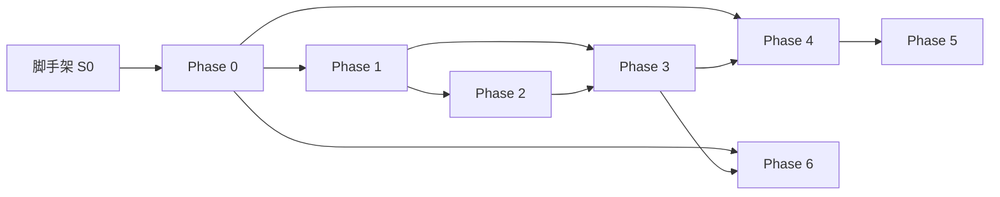

# EnterpriseFlow — 实现任务清单

> 基于 [ARCHITECTURE.md](./ARCHITECTURE.md) v0.6。每个 Phase 末尾列出**验收标准**；任务按推荐顺序排列，同组内可并行。

**图例：** `[P0]` 阻塞后续 · `[P1]` 本 Phase 必需 · `[P2]` 可延后

---

## 0. 工程脚手架（Phase 0 前置）

在 Obsidian 插件目录初始化工具链，与业务 Phase 0 可重叠进行。

| ID | 任务 | 产出 | 优先级 |
|----|------|------|--------|
| S0.1 | 初始化 Obsidian 插件工程（`manifest.json`、`esbuild`、`typescript`） | 可 `npm run build` 加载的空插件 | P0 |
| S0.2 | 配置 `tsconfig`（`strict`、path alias `@shared/*`） | `tsconfig.json` | P0 |
| S0.3 | ESLint + `eslint-plugin-import` 模块边界规则（[ARCH §13](./ARCHITECTURE.md#13-代码布局)） | `eslint.config.js` 禁止 core→wiki 等 | P0 |
| S0.4 | Vitest 单元测试框架；`tests/fixtures/` 目录约定 | `npm test` 通过空套件 | P1 |
| S0.5 | CI：`lint` + `test` + `build`（GitHub Actions 可选） | `.github/workflows/ci.yml` | P2 |

---

## Phase 0 — Core + 空门面

**目标：** 插件可加载；模块边界 enforced；共享类型与 Core 基础设施就绪；Wiki / Workflow 仅暴露 stub 接口。

### 0.1 共享类型 (`src/shared/types/`)

| ID | 任务 | 参考 | 测试 |
|----|------|------|------|
| 0.1.1 | `normalized-document.ts` — `NormalizedDocument`、`DocumentChunk`、`SourceLocator` 联合类型 | [§4](./ARCHITECTURE.md#4-normalizeddocument) | 定位器 JSON 往返 |
| 0.1.2 | `cached-extract.ts` — `CachedExtract`、`ExtractCacheMeta` | [§4.6](./ARCHITECTURE.md#46-磁盘缓存结构) | — |
| 0.1.3 | `wiki-instance.ts` — `WikiId`、`WikiInstance` | [§3.4](./ARCHITECTURE.md#34-wikiid-解析) | — |
| 0.1.4 | `wiki.ts` — `SourceAnalysis`、`EntityInfo`、`LintReport`、`MergePolicy`、`PageMergeRules` | [§5](./ARCHITECTURE.md#5-wiki-领域模型normalizeddocument-下游) | — |
| 0.1.5 | `wiki-schema.ts` — `WikiSchemaConfig`（对应 `config.md` frontmatter） | [§5.1.1](./ARCHITECTURE.md#511-wiki-schema-配置-configmd) | YAML 解析 fixture |
| 0.1.6 | `ingest-report.ts` — `IngestReport`、`IngestError`、`IngestWikiOptions` | [§5.8](./ARCHITECTURE.md#58-摄取与问答报告类型) | — |
| 0.1.7 | `query-catalog.ts` — `QueryCatalog`、`QueryOptions` | [§5.4](./ARCHITECTURE.md#54-query-索引最低可行) | — |
| 0.1.8 | `query-chunk.ts` — `QueryChunk` 联合类型 | [§5.8](./ARCHITECTURE.md#58-摄取与问答报告类型) | — |
| 0.1.9 | `workflow.ts` — `WorkflowDefinition`、`RunReport`、`WorkflowContext` 等 | [§8](./ARCHITECTURE.md#8-工作流定义契约) | — |
| 0.1.10 | `validation.ts` — `ValidationResult`、`ValidationIssue` | [§6.3](./ARCHITECTURE.md#63-工作流-srcworkflow) | — |
| 0.1.11 | `backup.ts` — `BackupManifest`、`BackupSettings` discriminated union | [§19](./ARCHITECTURE.md#19-vault-远程备份与恢复) | — |
| 0.1.12 | `bind-extract-context.ts` — 纯函数 `bindExtractContext` + title 优先级 | [§4.8](./ARCHITECTURE.md#48-缓存与-wiki-路径分离) | **P0** 单元测试 |

### 0.2 共享核心 (`src/core/`)

| ID | 任务 | 参考 | 测试 |
|----|------|------|------|
| 0.2.1 | `config/settings.ts` — `PluginSettings` 默认值、`DEFAULT_SETTINGS` | [§12](./ARCHITECTURE.md#12-设置概要) | 默认值快照 |
| 0.2.2 | `config/migrations.ts` — `settingsVersion` 迁移框架（v0 仅 identity） | [§15](./ARCHITECTURE.md#15-版本与迁移) | — |
| 0.2.3 | `events/event-bus.ts` — 类型化 `EventBus`（publish/subscribe/off） | [§11](./ARCHITECTURE.md#11-事件跨模块集成) | 订阅/取消 |
| 0.2.4 | `vault/vault-adapter.ts` — 读写、路径规范化、`normalizePath` 封装 | [§3.5](./ARCHITECTURE.md#35-路径规则) | mock `Vault` |
| 0.2.5 | `log/logger.ts` — 结构化 debug 日志（`settings` 控制级别） | [§6.1](./ARCHITECTURE.md#61-共享核心-srccore) | — |
| 0.2.6 | `jobs/job-queue.ts` — `Job`、`JobHandle`、状态机、取消 | [§10](./ARCHITECTURE.md#10-任务模型) | 排队/取消 |
| 0.2.7 | `jobs/dedup.ts` — ingest `wikiId+sourceId`、extract `contentHash` 去重 | [§10](./ARCHITECTURE.md#10-任务模型) | 并发去重 |
| 0.2.8 | `llm/llm-service.ts` — `LLMClient` 接口、重试、取消、`AbortSignal` | [§6.1](./ARCHITECTURE.md#61-共享核心-srccore) | mock HTTP |
| 0.2.9 | `cache/extract-cache.ts` — 读写 `.enterpriseflow/extracts/{hash}/` | [§4.6](./ARCHITECTURE.md#46-磁盘缓存结构) | 读写 roundtrip |
| 0.2.10 | `core-services.ts` — 装配 `CoreServices` 工厂 | [§6.1](./ARCHITECTURE.md#61-共享核心-srccore) | — |
| 0.2.11 | `backup/backup-service.stub.ts` — `BackupService` 接口 + `notImplemented` 实现 | [§19.5](./ARCHITECTURE.md#195-backupservice-api) | — |

### 0.3 Wiki 门面 stub (`src/wiki/`)

| ID | 任务 | 参考 |
|----|------|------|
| 0.3.1 | `instance-resolver.ts` — `resolveWikiId`、`listWikiInstances` | [§3.4](./ARCHITECTURE.md#34-wikiid-解析) |
| 0.3.2 | `service.ts` — `WikiService` 接口；各方法 `throw notImplemented` 或返回空 | [§6.2](./ARCHITECTURE.md#62-文档-wiki-srcwiki) |
| 0.3.3 | `instance-resolver` 单元测试 — 路径用例表（含违规 `raw/foo.pdf` → null） | [§3.4](./ARCHITECTURE.md#34-wikiid-解析) |

### 0.4 Workflow 门面 stub (`src/workflow/`)

| ID | 任务 | 参考 |
|----|------|------|
| 0.4.1 | `service.ts` — `WorkflowService` 接口 stub | [§6.3](./ARCHITECTURE.md#63-工作流-srcworkflow) |
| 0.4.2 | `schema/loader.ts` — 从 vault 读取 `*.workflow.json` 并 JSON 解析 | [§8.1](./ARCHITECTURE.md#81-文件格式) |

### 0.5 UI 外壳 (`src/main.ts`、`src/ui/`)

| ID | 任务 | 参考 |
|----|------|------|
| 0.5.1 | `main.ts` — `onload` 装配 `CoreServices`、`WikiService`、`WorkflowService` | [§6.4](./ARCHITECTURE.md#64-ui-外壳-srcuimaints) |
| 0.5.2 | 设置页骨架 — LLM 字段、路径字段、`activeWikiId` 下拉（`listWikiInstances`） | [§12](./ARCHITECTURE.md#12-设置概要) |
| 0.5.3 | 订阅 `restore:done` 占位 handler（Phase 6 填充逻辑） | [§6.4](./ARCHITECTURE.md#64-ui-外壳-srcuimaints) |
| 0.5.4 | 状态栏占位 — 显示插件版本 / 「未配置 LLM」 | — |
| 0.5.5 | Vault `create` 监听 → 防抖 → `file:added` 事件（仅派发，无工作流） | [§11](./ARCHITECTURE.md#11-事件跨模块集成)、[§12](./ARCHITECTURE.md#12-设置概要) |

### Phase 0 验收标准

- [ ] `npm run build` 产出可加载插件；Obsidian 启用无报错
- [ ] ESLint 拦截 `core/**` import `wiki/**`（故意违规文件应 fail）
- [ ] `bindExtractContext` 测试覆盖 title 优先级三档
- [ ] `resolveWikiId` 测试覆盖文档内全部示例路径
- [ ] `listWikiInstances` 仅枚举 `raw/` 直接子目录
- [ ] 设置保存/加载 roundtrip；`data.json` 含 `settingsVersion`
- [ ] `file:added` 在 `raw/{wikiId}/` 下创建文件后触发（devtools 或日志可观测）

---

## Phase 1 — 单抽取器 + 摄取 + 基础页面

**目标：** `text-plain` 或 `docx` 一种格式走通 `extract → ingest → wiki/{wikiId}/` 页面写入。

| ID | 任务 | 依赖 | 参考 |
|----|------|------|------|
| 1.1 | `extractors/registry.ts` — `ExtractorRegistry.route` | 0.2.9 | [§7](./ARCHITECTURE.md#7-抽取器插件契约) |
| 1.2 | `extractors/text-plain.ts` — 首个 `DocumentExtractor` | 1.1 | [§7.1](./ARCHITECTURE.md#71-内置抽取器计划) |
| 1.3 | `wiki/extract.ts` — `WikiService.extract`：hash → cache → bind | 1.2, 0.1.12 | [§4.8](./ARCHITECTURE.md#48-缓存与-wiki-路径分离) |
| 1.4 | `schema/schema-manager.ts` — 加载/默认 `config.md` | 0.1.5 | [§5.1.1](./ARCHITECTURE.md#511-wiki-schema-配置-configmd) |
| 1.5 | `engine/source-analyzer.ts` — mock 可注入；分批 chunk LLM 调用骨架 | 0.2.8 | [§5.1](./ARCHITECTURE.md#51-源分析llm-输出契约) |
| 1.6 | `engine/page-factory.ts` — 创建 entity/concept/source 页 + frontmatter | 1.4 | [§5.2](./ARCHITECTURE.md#52-wiki-页面-frontmatter最小集) |
| 1.7 | `engine/merge.ts` — `DEFAULT_PAGE_MERGE_RULES` + `mergePolicy` 矩阵 | 0.1.4 | [§5.5](./ARCHITECTURE.md#55-页面合并策略mergepolicy) |
| 1.8 | `engine/entity-resolver.ts` — slug、别名匹配、`merge-to-existing` | 1.6 | [§5.7](./ARCHITECTURE.md#57-实体解析entity-resolution) |
| 1.9 | `engine/wiki-engine.ts` — `ingest` 编排：analyze → factory → index.md | 1.5–1.8 | [§9.1](./ARCHITECTURE.md#91-从文件摄取模块-a) |
| 1.10 | `WikiService.ingest` / `ingestFile` 实现 | 1.9 | [§6.2](./ARCHITECTURE.md#62-文档-wiki-srcwiki) |
| 1.11 | 命令：「摄取当前文件」— 需 `activeWikiId` 或选择器 | 0.5.2 | [§12](./ARCHITECTURE.md#12-设置概要) |
| 1.12 | `wiki/{wikiId}/log.md` 追加摄取摘要 | 1.10 | [§3.2](./ARCHITECTURE.md#32-用户可见目录) |
| 1.13 | 发布 `extract:done`、`ingest:done` 事件 | 0.2.3 | [§11](./ARCHITECTURE.md#11-事件跨模块集成) |

### Phase 1 验收标准

- [ ] fixture `.txt` 放入 `raw/legal/` → 命令摄取 → 生成 `wiki/legal/sources/*.md` + entities/concepts
- [ ] `reviewed: true` 页重新摄取不覆盖正文（merge 矩阵 manual 测试）
- [ ] 同名实体第二次摄取合并到同一页（非新建 `-2`）
- [ ] `ingest:done` 事件载荷含 `IngestReport`
- [ ] `wikiId` 与 `sourceId` 不一致时 fail fast

---

## Phase 2 — 全部抽取器 + 抽取缓存

**目标：** §7.1 所列格式均可抽取；缓存命中跳过解析；PDF 路由按 §7.2。

| ID | 任务 | 参考 |
|----|------|------|
| 2.1 | `docx-mammoth` 抽取器 | [§7.1](./ARCHITECTURE.md#71-内置抽取器计划) |
| 2.2 | `xlsx-sheetjs` 抽取器 + sheet 分块 | [§4.2](./ARCHITECTURE.md#42-分块-chunks) |
| 2.3 | `pdf-text` + `pdf-vision` + §7.2 路由 | [§7.2](./ARCHITECTURE.md#72-pdf-抽取器路由) |
| 2.4 | `image-vision` 抽取器 | [§7.1](./ARCHITECTURE.md#71-内置抽取器计划) |
| 2.5 | 缓存失效 — `extractorVersion` / `schemaVersion` 升级 | [§4.6](./ARCHITECTURE.md#46-磁盘缓存结构) |
| 2.6 | `meta.json.referencedBy` 追加与上限 | [§4.8](./ARCHITECTURE.md#48-缓存与-wiki-路径分离) |
| 2.7 | `ingestWiki` — glob、`skipUnchanged`、`concurrency` | [§5.8](./ARCHITECTURE.md#58-摄取与问答报告类型) |
| 2.8 | 启动扫描 — `raw/` 根目录违规文件告警 | [§3.1](./ARCHITECTURE.md#31-多-wiki-实例模型) |
| 2.9 | 抽取器 fixture 黄金测试（每种格式至少 1 个） | [§14](./ARCHITECTURE.md#14-测试策略) |

### Phase 2 验收标准

- [ ] 同一 PDF 复制到两个 Wiki → 仅一次磁盘解析；两次 ingest 写入不同 `wikiId`
- [ ] 扫描 PDF + `defaultOcr: auto` → 走 vision；`off` → `empty_text` 警告
- [ ] `ingestWiki('legal')` 批量完成并更新 `index.md`
- [ ] 抽取器测试在无 Obsidian 环境可运行

---

## Phase 3 — Query + Lint

**目标：** Wiki 模块功能完整（问答 + 质量检查）。

| ID | 任务 | 参考 |
|----|------|------|
| 3.1 | `engine/query-catalog.ts` — 构建/增量更新 `catalog.json` | [§5.4](./ARCHITECTURE.md#54-query-索引最低可行) |
| 3.2 | `engine/query-engine.ts` — 关键词召回 + LLM 重排 + 上下文组装 | [§5.4](./ARCHITECTURE.md#54-query-索引最低可行) |
| 3.3 | Token 启发式 `ceil(chars/4)` + `maxContextTokens` 截断 | [§5.4](./ARCHITECTURE.md#54-query-索引最低可行) |
| 3.4 | `WikiService.query` — `AsyncIterable<QueryChunk>` 流式 | [§5.8](./ARCHITECTURE.md#58-摄取与问答报告类型) |
| 3.5 | `WikiService.regenerateIndex` | [§5.4](./ARCHITECTURE.md#54-query-索引最低可行) |
| 3.6 | `engine/lint/` — 全部 `LintIssueCode` | [§5.6](./ARCHITECTURE.md#56-lint-报告lintreport) |
| 3.7 | `ContradictionInfo` 写入 source 页 `## Contradictions` | [§5.1.2](./ARCHITECTURE.md#512-矛盾信息持久化-contradictioninfo) |
| 3.8 | Mentions 引用格式 + locator 渲染 | [§5.3](./ARCHITECTURE.md#53-wiki-页面引用格式) |
| 3.9 | UI：问答弹窗、Lint 报告视图 | — |
| 3.10 | 发布 `lint:done`；UI 写 log 摘要 | [§11](./ARCHITECTURE.md#11-事件跨模块集成) |

### Phase 3 验收标准

- [ ] Query 在单个 `wikiId` 内返回带 `[[wiki/...]]` 的回答
- [ ] `regenerateIndex` 后 `catalog.json` 与页面一致
- [ ] Lint 检出 `dead_link`、`duplicate_entity` fixture
- [ ] `reviewed` + merge 矩阵全组合单元测试通过

---

## Phase 4 — 工作流运行时

**目标：** 无画布 UI 情况下，可用 JSON 定义 + 命令触发工作流执行（含子工作流）。

| ID | 任务 | 参考 |
|----|------|------|
| 4.1 | `registry/node-registry.ts` — `NodeTypeDefinition` 注册表 | [§8.3](./ARCHITECTURE.md#83-节点处理器契约) |
| 4.2 | `runtime/template.ts` — `{{var}}` / `{{var.path}}` 解析 | [§8.5](./ARCHITECTURE.md#85-表达式与变量替换v0) |
| 4.3 | `runtime/executor.ts` — DAG 拓扑排序、边绑定、分支 | [§8.4](./ARCHITECTURE.md#84-标准节点类型v0) |
| 4.4 | `runtime/context.ts` — `WorkflowContext`、变量表 | [§8.2](./ARCHITECTURE.md#82-嵌套工作流子工作流) |
| 4.5 | `runtime/nested-runner.ts` — 子工作流调度、深度限制 | [§8.2](./ARCHITECTURE.md#82-嵌套工作流子工作流) |
| 4.6 | `schema/validator.ts` — 环检测、`duplicate_workflow_id`、端口校验 | [§6.3](./ARCHITECTURE.md#63-工作流-srcworkflow) |
| 4.7 | 标准节点实现（§8.4 全部 type） | [§8.4](./ARCHITECTURE.md#84-标准节点类型v0) |
| 4.8 | `trigger.file-added` — 匹配 `wikiId`、防抖、多工作流并行 | [§8.4](./ARCHITECTURE.md#84-标准节点类型v0) |
| 4.9 | `.enterpriseflow/runs/{rootRunId}/` 树形运行日志 | [§3.3](./ARCHITECTURE.md#33-内部--缓存目录) |
| 4.10 | 运行记录清理 — R11 OR 语义 | [§18.1 R11](./ARCHITECTURE.md#181-已决v06) |
| 4.11 | `WorkflowService.run` / `cancel`；`workflow:done` 事件 | [§11](./ARCHITECTURE.md#11-事件跨模块集成) |

### Phase 4 验收标准

- [ ] 示例 `ingest-and-summarize.workflow.json`（§8.2）端到端跑通
- [ ] 子工作流深度 > `maxWorkflowNestingDepth` 拒绝执行
- [ ] A→B→A 环 `validate` 报错 `cycle_detected`
- [ ] 取消根运行递归取消子运行
- [ ] `wiki.ingest` 节点未配 `wikiId` 时失败（不回落 `activeWikiId`）

---

## Phase 5 — 工作流画布 UI

**目标：** React Flow 可视化编辑与嵌套运行树。

| ID | 任务 | 参考 |
|----|------|------|
| 5.1 | React + React Flow 集成（Obsidian ItemView） | [§6.3](./ARCHITECTURE.md#63-工作流-srcworkflow) |
| 5.2 | 节点面板 — 注册表驱动节点拖拽 | [§8.4](./ARCHITECTURE.md#84-标准节点类型v0) |
| 5.3 | 节点检查器 — `data` 表单 + JSON Schema 校验 | — |
| 5.4 | 边连接 — `fromPort` / `toPort`（`branch.if`） | [§8.1](./ARCHITECTURE.md#81-文件格式) |
| 5.5 | 保存/加载 `workflows/*.workflow.json` | [§8.1](./ARCHITECTURE.md#81-文件格式) |
| 5.6 | 运行面板 — 嵌套 `RunReport` 树形展示 | [§8.2](./ARCHITECTURE.md#82-嵌套工作流子工作流) |
| 5.7 | `validate()` 结果在画布上标注错误节点 | — |

### Phase 5 验收标准

- [ ] 画布创建流程 → 保存 → 重载 → 执行结果与 Phase 4 一致
- [ ] 子工作流节点可 Pick `workflowRef`（路径浏览）

---

## Phase 6 — Vault 远程备份

**目标：** S3 或 GitHub 快照 push/pull；恢复 merge；UI 二次确认 replace。

| ID | 任务 | 参考 |
|----|------|------|
| 6.1 | `backup/snapshot.ts` — zip 打包/解包 + `BackupManifest.files[]` | [§19.3](./ARCHITECTURE.md#193-快照格式) |
| 6.2 | `backup/scope.ts` — `full` / `enterpriseflow` 路径过滤 + 默认排除 | [§19.2](./ARCHITECTURE.md#192-备份范围) |
| 6.3 | `providers/s3-provider.ts` — list/push/pull + `latest.json` | [§19.4](./ARCHITECTURE.md#194-提供商路径约定) |
| 6.4 | `providers/github-provider.ts` — Contents API + 50/75 MB 限制 | [§19.4](./ARCHITECTURE.md#194-提供商路径约定)、R15 |
| 6.5 | `backup-service.ts` — 完整实现替换 stub | [§19.5](./ARCHITECTURE.md#195-backupservice-api) |
| 6.6 | restore `merge` — 按 manifest `contentHash` + `modifiedAt` | [§19.5](./ARCHITECTURE.md#195-backupservice-api) |
| 6.7 | `retentionCount` 清理旧快照 | R12 |
| 6.8 | 设置页 — provider 单选、凭据表单、测试连接 | [§19.6](./ARCHITECTURE.md#196-用户界面与命令) |
| 6.9 | UI — `restore:done` → 提示 `regenerateIndex`（按路径解析 `wikiId`） | [§6.4](./ARCHITECTURE.md#64-ui-外壳-srcuimaints) |
| 6.10 | 节点 `vault.backup.push` / `vault.backup.pull` | [§19.7](./ARCHITECTURE.md#197-与工作流集成) |
| 6.11 | 定时 `scheduleIntervalHours` push | [§19.1](./ARCHITECTURE.md#191-提供商互斥) |

### Phase 6 验收标准

- [ ] MinIO 或 AWS S3 push → list → pull merge 往返
- [ ] GitHub 私有 repo push/pull；> 75 MB 阻断
- [ ] `replace` 模态框展示 `filesDeleted` 预估；工作流未确认 `replace` 拒绝
- [ ] 恢复后 UI 提示对受影响 Wiki 执行 `regenerateIndex`

---

## 依赖关系总览

- **Phase 3** 依赖 Phase 1 的 ingest 产出页面；Phase 2 可与 Phase 3 部分并行（Query 不依赖 PDF）。
- **Phase 4** 可在 Phase 3 完成前用 stub `WikiService` 测运行时，但节点 `wiki.*` 需 Phase 1+。
- **Phase 6** 仅依赖 Core，可与 Phase 4/5 并行开发。

---

## 建议首期 Sprint（1–2 周）

仅交付 **脚手架 + Phase 0 + Phase 1（text-plain）**：

1. S0.1–S0.4、0.1.1–0.1.4、0.1.12、0.2.1–0.2.10  
2. 0.3、0.4、0.5  
3. 1.1–1.2、1.3–1.10、1.11–1.13  

**Sprint 结束演示：** 用户将 `.txt` 放入 `raw/demo/`，一键摄取，在 `wiki/demo/` 浏览生成的知识页。

---

## 与架构文档的追踪

| 架构章节 | 主要 Phase |
|----------|-----------|
| §3 Vault 目录 | 0, 1, 2 |
| §4 NormalizedDocument | 0, 1, 2 |
| §5 Wiki 模型 | 1, 3 |
| §6 模块边界 | 0 |
| §7 抽取器 | 1, 2 |
| §8 工作流 | 4, 5 |
| §9 数据流 | 1–5 联调 |
| §10–§11 任务/事件 | 0, 1, 4 |
| §12 设置 | 0, 5, 6 |
| §19 备份 | 6 |

架构变更时同步更新本清单任务 ID 与验收标准。
